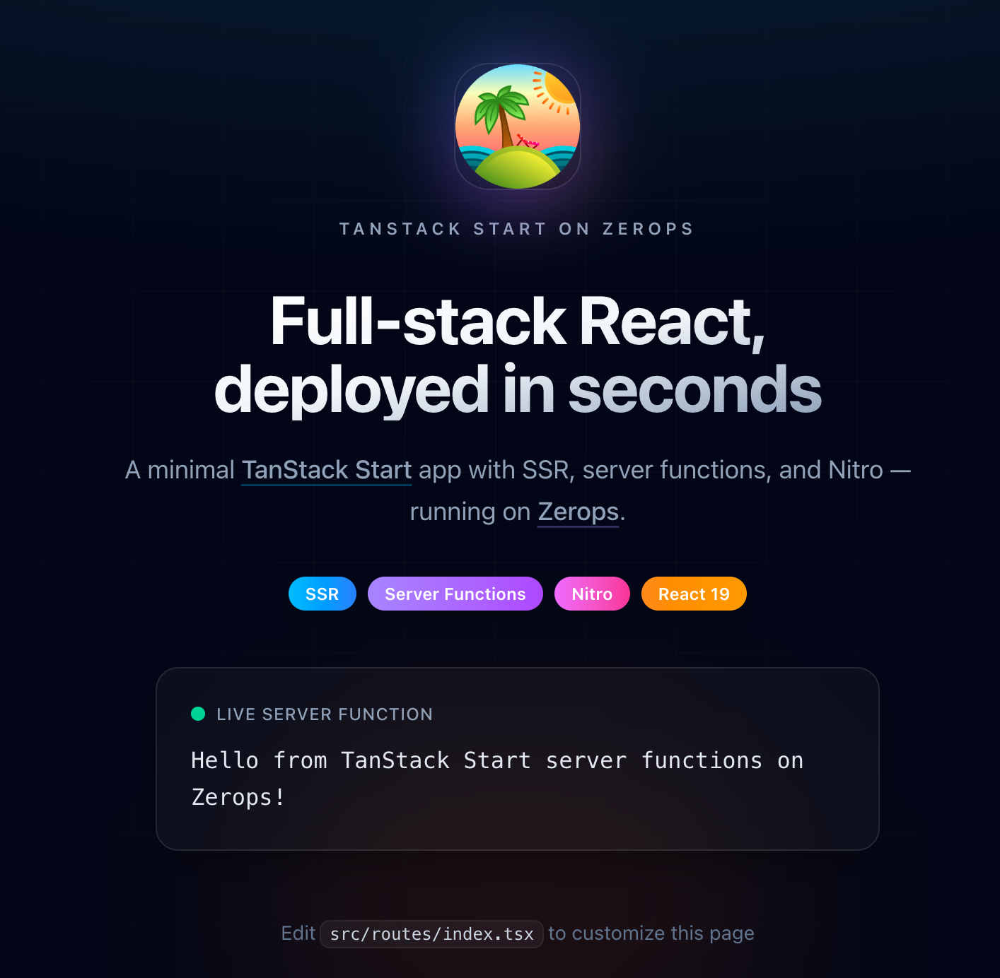

# TanStack Start Hello World Recipe App

<!-- #ZEROPS_EXTRACT_START:intro# -->
A server-rendered [TanStack Start](https://tanstack.com/start/latest) application with Nitro Node output and a sample server function — deployed on [Zerops](https://zerops.io).
<!-- #ZEROPS_EXTRACT_END:intro# -->

Used within [TanStack Start Hello World recipe](https://app.zerops.io/recipes/tanstack-start-hello-world) for [Zerops](https://zerops.io) platform.

⬇️ **Full recipe page and deploy with one-click**

[](https://app.zerops.io/recipes/tanstack-start-hello-world?environment=small-production)



## Integration Guide

<!-- #ZEROPS_EXTRACT_START:integration-guide# -->

### 1. Adding `zerops.yaml`

TanStack Start uses the [Nitro Vite plugin](https://tanstack.com/start/latest/docs/framework/react/guide/hosting#nitro) for Node.js deployment. Production output lives in `.output/` — the same Nitro pattern as Nuxt.

```yaml
zerops:
  - setup: prod
    build:
      base: nodejs@22
      buildCommands:
        - npm install --ignore-scripts=false --min-release-age=0
        - npm run build
      deployFiles:
        - .output
      cache:
        - node_modules
        - .nitro
    deploy:
      readinessCheck:
        httpGet:
          port: 3000
          path: /
    run:
      base: nodejs@22
      ports:
        - port: 3000
          httpSupport: true
      envVariables:
        NODE_ENV: production
      start: node .output/server/index.mjs

  - setup: dev
    build:
      base: nodejs@22
      os: ubuntu
      buildCommands:
        - npm install --ignore-scripts=false --min-release-age=0
      deployFiles: ./
      cache:
        - node_modules
    run:
      base: nodejs@22
      os: ubuntu
      ports:
        - port: 3000
          httpSupport: true
      envVariables:
        NODE_ENV: development
      start: zsc noop --silent
```

### 2. `vite.config.ts` essentials

```ts
import { tanstackStart } from '@tanstack/react-start/plugin/vite'
import { defineConfig } from 'vite'
import viteReact from '@vitejs/plugin-react'
import { nitro } from 'nitro/vite'

export default defineConfig({
  plugins: [tanstackStart(), viteReact(), nitro()],
})
```

### 3. Local development

```bash
npm install --ignore-scripts=false --min-release-age=0
npm run dev
```

Production smoke test:

```bash
npm run build
npm run start
```

<!-- #ZEROPS_EXTRACT_END:integration-guide# -->
